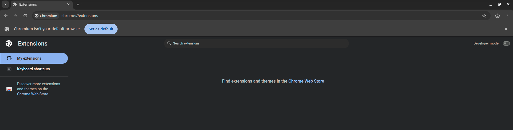
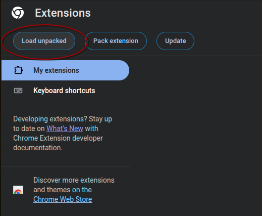

# Instergater

>  
> Warning: Contains "AI-Slop"     
> This software was architected by algorithms and merely reviewed by a human. It serves as a digital barrier against the very forces that created it.
>   

  

  

 Your Gate-Keeping Instagram Extension 
 (Not affiliated with, endorsed by, or sponsored by Instagram or Meta)

 

 

  

 

## ⚠️ Disclaimer & Liability
**READ CAREFULLY**:
This software is provided "as is", without warranty of any kind.
*   **TOS Violation**: Using this extension likely violates Instagram's Terms of Service regarding automated data collection or interface modification.
*   **Account Risk**: Use at your own risk. The developer is not liable for account bans, suspensions, or limitations resulting from the use of this tool.
*   **No Affiliation**: This project is not affiliated with, endorsed by, or sponsored by Instagram or Meta Platforms, Inc.

 

## 🧠 The Philosophy of the Gate

I built Instergater because modern social media is not merely a tool but rather an environment designed to strip you of your autonomy. The algorithmic feeds we consume are inherently immoral because they systematically violate the conditions necessary for a flourishing human life:

1.  **Alienation**: The algorithm disconnects us from our true selves, replacing our authentic desires with manufactured cravings for engagement.
2.  **Internal Motivational Coherence**: It fragments our attention, making it impossible to align our short-term actions (scrolling) with our long-term values (creating, living).
3.  **Non-Adaptive Preferences**: We learn to prefer the infinite scroll not because it is good, but because we have adapted to the constraints of the cage.
4.  **Baseline Competence**: By outsourcing our validation to external metrics (likes), we atrophy our ability to judge our own worth.
5.  **External Constraints**: The design patterns (infinite scroll, auto-play) are not neutral choices; they are shackles.

This extension is a nihilistic attempt to use code to break the code. It is a "gate" that forces friction into a frictionless system, returning a small sliver of agency to the user.

 

## ✨ Features

- **Breathing Room**  
  *Enforces a deep breath (delay) before entering the feed.*

- **Scroll Limits**  
  *Hard locks the feed after a set number of posts.*

- **Validation Removal**  
  *Hides likes, shares, and comments to re-center your internal locus of evaluation.*

- **Navigation Removal**
  Hides search, messages, notificaitons, and more navigation button to prevent diving further into addiction.

- **Data Sovereignty**  
  *Download media to own it, rather than just consuming it.*

 

## 🔍 Open Source & Transparency
This project is fully open source. The code is unminified and available for you to inspect.
- **Privacy**: No external analytics. No data harvesting.
- **Safety**: Designed to be non-malicious. You are encouraged to read the source code (`content.js`, `background.js`) yourself to verify. *(This should be standard practice before installing anything!)*

 

## 🚀 Installation

### Option 1: Official Store (Recommended)

| Browser | Link |
| :--- | :--- |
|  | [Download from Chrome Web Store](#) *(Coming Soon)* |
|  | [Download from Edge Add-ons](#) *(Coming Soon)* |
|  | [Download from Firefox Add-ons](https://addons.mozilla.org/en-US/firefox/addon/instergater/) |
 

 

### Option 2: Manual Installation (Developer Mode)
If the store version is unavailable or you want to inspect/modify the code:

**Step 1: Get the Code**  
Go to the [**Latest Release**](https://github.com/Lin8x/Instergater/releases) page. Download the "Source code (zip)" and extract it to a folder on your computer.

**Step 2: Open Extensions Management**  
Open Chrome and navigate to `chrome://extensions` (or click the puzzle piece icon > Manage Extensions).

  

**Step 3: Enable Developer Mode**  
Toggle the "Developer mode" switch in the top right corner of the page.

**Step 4: Load Unpacked**  
Click the "Load unpacked" button that appears in the top left.

**Step 5: Select Folder**  
Select the folder where you extracted the files. The extension should now be active.

**Firefox specific steps**  
1. Run `./build.sh` to create platform-specific builds (or manually: duplicate the folder and rename `manifest.firefox.json` to `manifest.json`).  
2. Open `about:debugging#/runtime/this-firefox`.  
3. Click **Load Temporary Add-on**, browse to `build/firefox/` and select `manifest.json`.

> **Note:** Firefox temporary add-ons are removed when Firefox closes. For permanent installation, install from the Firefox Add-ons store once available.

 

## ❓ FAQ

**Will this be actively maintained?**  
Not necessarily. This project was built for my personal need to reduce Instagram usage. Unless a community forms around it to contribute fixes and features, updates might be sporadic.

**Why did you build this?**  
I wanted to get off Instagram but couldn't find a reliable, open-source tool that actually worked. This was built out of love (and necessity) to reclaim my attention span.

**How can I support the project?**  
If you find this useful, please **give this repository a Star ⭐**. It helps with visibility and supports my career as a developer.

**Why no mobile app?**  
The Instagram app is designed for maximum data collection and accessibility, making it higher risk for those trying to quit. A browser extension minimizes this footprint.
*   *Android Users*: You can actually use this on mobile by using a browser that supports extensions, such as **Kiwi Browser** or **Firefox**.

**I found a bug or have a suggestion, what now?**  
Check the [**Issues**](../../issues) tab to see if it's already been reported. If not, please open a new issue describing the problem. Standard GitHub etiquette applies!

 

## ⚖️ Governance
*   [CONTRIBUTING](./CONTRIBUTING.md)
*   [SECURITY](./SECURITY.md)
*   [LICENSE](./LICENSE.md)

 

